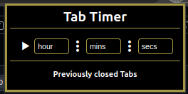
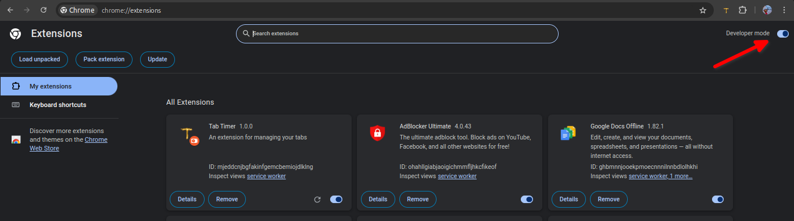

# TabTimer

TabTimer helps you keep your browser clutter-free by automatically closing idle tabs after a user-set timer. Simply set how long tabs can remain unused, and TabTimer will handle the rest, improving your browsing speed and organization effortlessly.



## Features

- Tracking mechanism for tracking each idle tab time separately
- Support for hourly, minutes and seconds monitoring.
- Caching recently closed tabs, for faster navigation.
- Play/Pause button to handle starting and pausing mechanism.


## Demo

<video controls src="images/InShot_20241014_214543643.mp4" title="demo video of tab timer"></video>


## Build Instructions

- Clone the repository
```
git clone https://github.com/kofiad/TabTimer.git
```


- Activate Developer Mode in Chrome.
Visit: chrome://extensions




- Load unpacked


😁 Enjoy a good tab manager extension on your browser !

- To contribute, send in your pull request.


## Contributors

- Gilbert Henyo <kofidaba@gmail.com>
- Oluwamayowa Musa <oluwamayowamusa01@gmail.com>
- Wiseman Umanah <wisemanumanah@gmail.com>


Feel free to contact us!
